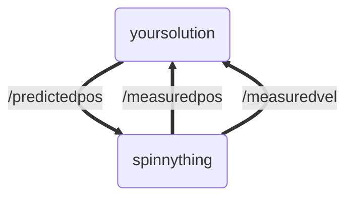

# TR-Autonomy-1
First Training Module for TR Autonomy Recruits

[](https://github.com/Triton-Robotics-Training/TR-CV-0/blob/main/resources.md)

## Task Overview

This module works with [publishers and subscribers](https://docs.ros.org/en/humble/Tutorials/Beginner-Client-Libraries/Writing-A-Simple-Cpp-Publisher-And-Subscriber.html). A quick summary is that publishers can publish data to a topic (such as /measuredpos), and subscribers will receive that data.  
In this module, you will have available to you a topic that publishes the measured position and velocity of a target moving around a circle in 1.5 second intervals. Your task is to subscribe to the published data (part 1) and publish to your custom topic your predictions of where the data will be (part 2).

The below video shows what the tracker output should look like. The target is represented by `//` and our estimate is represented by `\\`. When they coincide, they are represented by `╳╳`

https://github.com/Triton-Robotics-Training/TR-CV-1/assets/33632547/c09eebcf-4f47-490b-9f65-17ddb58e281f

## Getting Started

[Workspaces](https://docs.ros.org/en/humble/Tutorials/Beginner-Client-Libraries/Creating-A-Workspace/Creating-A-Workspace.html) are directories for ROS2 packages. Start by opening a terminal and creating a training workspace directory for your ROS2 training packages. 
```
mkdir training_ws/src
cd training_ws/src
```
Then, clone this github repository into the workspace.
```
git clone https://github.com/Triton-Robotics-Training/TR-CV-1.git
```
Next you have to build the packages. Source the root setup file from your ros installation (typically in `/opt/ros/humble/setup.bash`) in the shell you are building in.
Then at the root of this workspace, first isntall any necessary dependencies using [rosdep](https://docs.ros.org/en/humble/Tutorials/Intermediate/Rosdep.html), then run `colcon build`. This generates an overlay with your packages. You then have to open a new terminal, navigate to your workspace directory, and `source install/setup.bash` to source your overlay. This set of commands commands are run every time you setup a new package. [Reference](https://docs.ros.org/en/humble/Tutorials/Beginner-Client-Libraries/Creating-A-Workspace/Creating-A-Workspace.html)
```
cd ..
source /opt/ros/humble/setup.bash
rosdep install -i --from-path src --rosdistro humble -y
colcon build
OPEN_NEW_TERMINAL
cd training_ws
source install/setup.bash
```

Finally, you can run the *spinnything* node which makes the target visualization, publishes the tracking data, and listens for the predicted position.
```bash
ros2 run spinnything spinnything
```

The output should look like the following. Notice the predicted position is not moving, 

https://github.com/Triton-Robotics-Training/TR-CV-1/assets/33632547/c80cfce8-6c66-4b9f-a2fd-f210406cc211

Whenever you make file changes, all you have to do is run colcon build and run the package again:

## Architecture

The point of this assignment is to get used to writing ROS2 publishers and subscribers in a non-trivial example.

When running spinnything, there is a spinnything node:
```bash
~/Documents/TR-CV-1$ ros2 node list
/spinnything
```

We can also see what topics there are:
```bash
~/Documents/TR-CV-1$ ros2 topic list
/measuredpos
/measuredvel
/parameter_events
/predictedpos
/rosout
```
The topics published by spinnything are `/measuredpos` and `/measuredvel`. We can check how often they are published:
```bash
~/Documents/TR-CV-1$ ros2 topic hz /measuredpos
average rate: 0.663
	min: 1.501s max: 1.517s std dev: 0.00821s window: 2
```
It is up to you to publish `/predictedpos` much faster than this:
```
~/Documents/TR-CV-1$ ros2 topic hz /predictedpos
average rate: 2000.087
	min: 0.000s max: 0.001s std dev: 0.00003s window: 2002
```

To do this, you write a node in the `your_solution` package



Basically, you listen to /measuredpos and /measuredvel from spinnything. Then, using that data you make predictions to /predictedpos, which spinnything subscribes to and updates the tracker accordingly. The messages are all of type `ArrayMsg = std_msgs::msg::Float64MultiArray`, the 0th entry is the x coordinate, the 1st entry is the y coordinate.

In order to predict the location of the target: use the following algorithm:

$\vec{x_p} = \vec{x} + \Delta t \vec{v}$

Where $x_p$ is the predicted position vector, $x$ and $v$ are previously measured position and velocity, and $\Delta t$ is the change in time since the measurement was received by your node.

## What you need to do:

### Part 1 (Optional)

Create a [node](https://docs.ros.org/en/humble/Tutorials/Beginner-CLI-Tools/Understanding-ROS2-Nodes/Understanding-ROS2-Nodes.html) (the code is set up for you in `spin_slow_update.cpp` and `spin_slow_update.h`) that takes the measured position and immediately republishes it to the predicted postion. The result should look like this:

https://github.com/Triton-Robotics-Training/TR-CV-1/assets/33632547/2b949c8f-c465-4124-879e-83cc3d86424f

### Part 2 (Required)

Create a node (the code is set up for you in `spin_sol.cpp` and `spin_sol.h`) that predicts the position of the target (using the algorithm above) and publishes it more frequently than the measurements. It should use a rclcpp wall timer callback to do this. The final product should look like this:

https://github.com/Triton-Robotics-Training/TR-CV-1/assets/33632547/c09eebcf-4f47-490b-9f65-17ddb58e281f

### Submission Directions

Commit your completed code for Part 2 (and optionally Part 1) to this github repo, and submit it if that's possible (IDK how GH classroom works)
