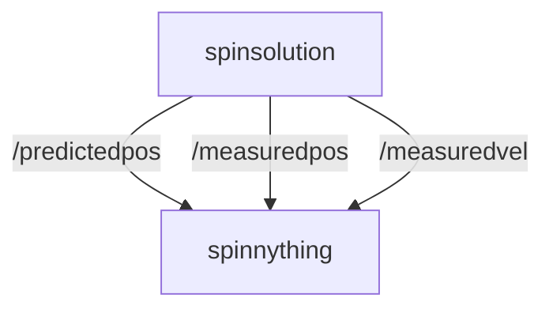

# TR-CV-1
First Training Module for TR CV Recruits

## Task Overview

In this module you will be given regularly measured position and velocity of a target to track. However, these measurements will only be published every 1.5 seconds, so it is your job to estimate the intermediate positions.

The below video shows what the tracker output should look like. The target is represented by `//` and the estimate is represented by `\\`. When they coincide, they are represented by `╳╳`

https://github.com/Triton-Robotics-Training/TR-CV-1/assets/33632547/2f9e1f60-66f7-47f5-a5de-5a473507371d

## Getting Started

First you have to set up a conda environment for the UI/data node, called *spinnything*.

```bash
conda env create -f src/spinnything/environment.yml
```

Next you have to build the packages. Source the setup file from your ros installation (typically in `/opt/ros/humble/setup.bash`) in the shell you are building in.
Then at the root of this git repo, run `colcon build`. Finally, run `source install/setup.bash`. Those last 2 commands are run every time you want to rebuild your solution.

Finally, you can run the *spinnything* node which makes the target visualization, publishes the tracking data, and listens for the predicted position.
```bash
ros2 run spinnything spinnything
```

The output should look like the following. Notice the predicted position is not moving, 

https://github.com/Triton-Robotics-Training/TR-CV-1/assets/33632547/a562bd09-c33b-44f0-9518-a1e047f7178b

## Architecture

The point of this assignment is to get used to writing ROS2 publishers and subscribers in a non-trivial example.

When running spinnything, there is a spinnything node:
```bash
~/Documents/TR-CV-1$ ros2 node list
/spinnything
```

We can also see what topics there are:
```bash
~/Documents/TR-CV-1$ ros2 topic list
/measuredpos
/measuredvel
/parameter_events
/predictedpos
/rosout
```
The topics published by spinnything are `/measuredpos` and `/measuredvel`. We can check how often they are published:
```bash
~/Documents/TR-CV-1$ ros2 topic hz /measuredpos
average rate: 0.663
	min: 1.501s max: 1.517s std dev: 0.00821s window: 2
```
It is up to you to publish `/predictedpos` much faster than this:
```
~/Documents/TR-CV-1$ ros2 topic hz /predictedpos
average rate: 2000.087
	min: 0.000s max: 0.001s std dev: 0.00003s window: 2002
```

To do this, you write a node in the `your_solution` package




## What you need to do:

### Part 1 (optional)

